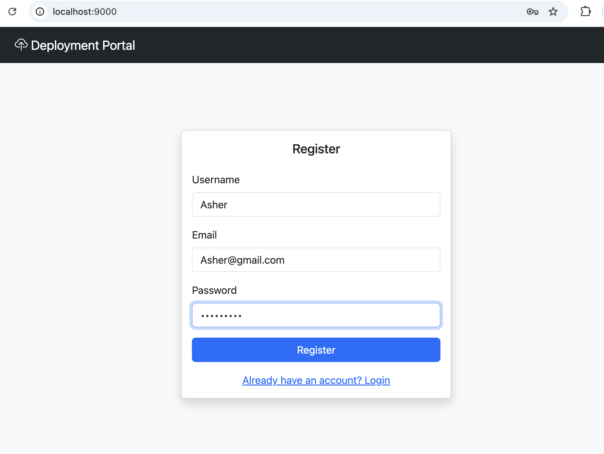
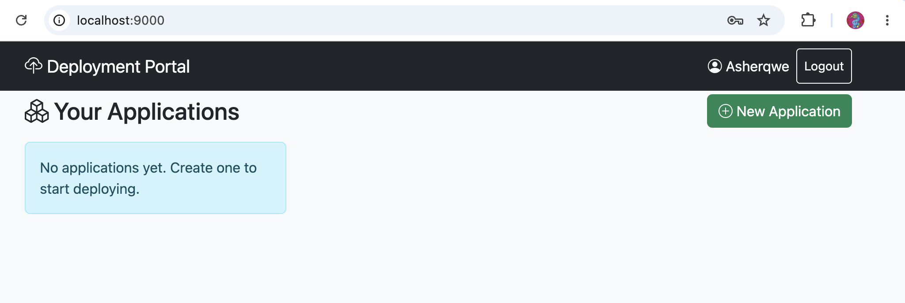
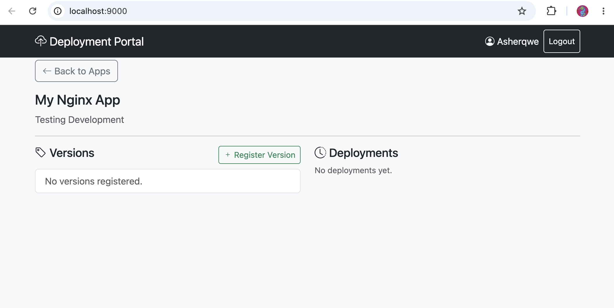
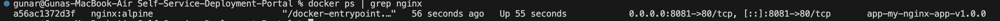
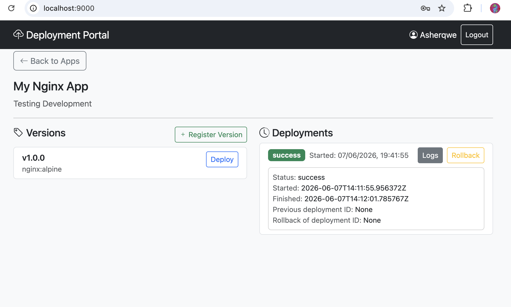
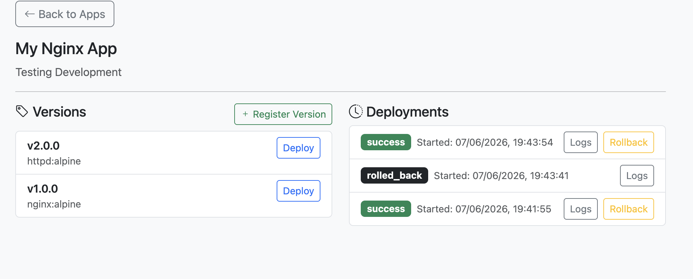
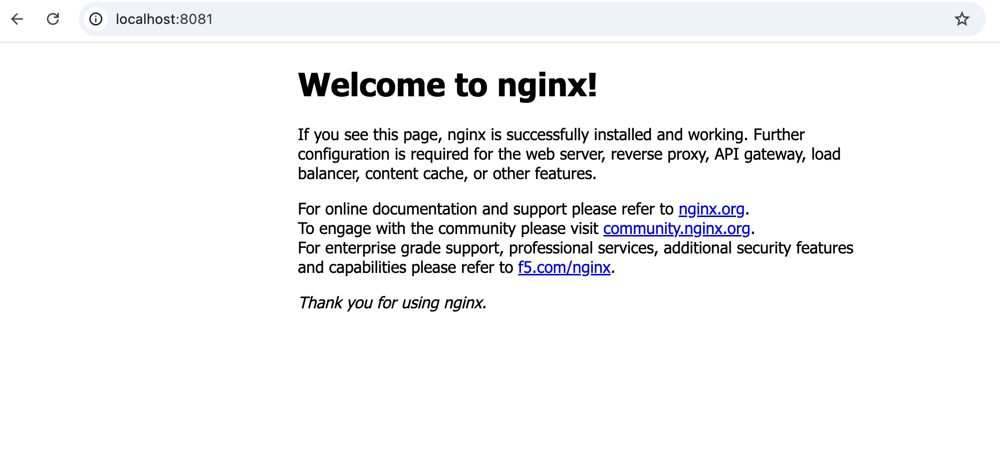

# Self‑Service Deployment Portal

> **A production‑ready internal platform for deploying Dockerized applications through a web interface – no more SSH, no manual `docker run`, no human error.**

[](https://python.org)
[](https://fastapi.tiangolo.com)
[](https://www.postgresql.org)
[](https://docker.com)
[](LICENSE)

---

## 📌 Project Status

- **Initial README**: includes project documentation (setup + usage) and an engineering/development diary (decisions, debugging history, root-cause analysis, fixes, and lessons learned).

---

## 🚀 Step-by-step guide

Step-by-step guide to get your Self-Service Deployment Portal up and running – whether you’re starting fresh on a new machine or showing it to someone else.

### 1. Prerequisites

- Docker and Docker Compose v2 installed
- Git installed
- (Optional) Python 3.11+ if you want to run outside Docker

### 2. Clone the repository

```bash
git clone https://github.com/Guna-Asher/Self-Service-Deployment-Portal.git
cd Self-Service-Deployment-Portal
```

### 3. Set up environment variables

Create your `.env` file from the example:

```bash
cp .env.example .env
```

Important – open `.env` and change:

- `SECRET_KEY` – generate a strong random key with:

```bash
openssl rand -hex 32
```

Paste the output as the value of `SECRET_KEY`.

- `DEFAULT_PORT_BINDING` – already set to `8081:80`. Change if port `8081` is already used on your machine.

Leave the other values as they are.

### 4. Start the stack (API + Database)

```bash
docker compose up -d --build
```

Wait a few moments for both services to become healthy:

```bash
docker compose ps
```

You should see:

- `self-service-deployment-portal-db-1` – status healthy
- `self-service-deployment-portal-api-1` – status Up

### 5. Run database migrations

```bash
docker compose exec api alembic upgrade head
```

You should see output like:

```text
INFO  [alembic.runtime.migration] Running upgrade -> xxxxxxx, initial
```

### 6. Open the dashboard

Go to http://localhost:9000 in your browser.

You’ll see the Login / Register page.

### 7. Quick usage walkthrough

#### Register a user

- Click “Don’t have an account? Register”
- Fill in a username, email, and password (min 8 characters)
- Click Register – you’ll be logged in automatically

#### Create an application

- Click the green “New Application” button
- Give it a name (e.g. “My Nginx App”) and description
- Click Create

#### Register a version

- Click the application card to enter its detail view
- Under Versions, click Register Version
- Version Tag: `v1.0`
- Image Name: `nginx:alpine` (a public image)
- Click Register

#### Deploy

- Click the Deploy button next to the version
- The deployment status will appear on the right and update every few seconds
- Once it shows success, open a terminal and check:

```bash
docker ps | grep nginx
curl http://localhost:8081
```

You should see the nginx welcome page.

#### Rollback (optional)

- Add a second version (e.g. image `httpd:alpine`) and deploy it
- On the deployment list, click Rollback next to that new deployment
- The system will automatically revert to the previous version
- Verify by checking `curl http://localhost:8081` again (should be nginx)

### 8. Stop everything

```bash
docker compose down
```

### 9. Optional: view the database logs

If you need to see the deployment logs directly:

```bash
docker compose exec db psql -U postgres -d deployment_portal -c \
  "SELECT timestamp, level, message FROM deployment_logs WHERE deployment_id = '<deployment-id>' ORDER BY timestamp;"
```

Replace `<deployment-id>` with the actual UUID from the dashboard or from a previous database query.

### 10. Deploying to AWS EC2 (summary)

- Launch an EC2 instance (Amazon Linux 2, t2.micro) with ports 22, 9000, 8081 open
- SSH in and install Docker + Docker Compose
- Clone the repo, create `.env` (with a strong `SECRET_KEY`), and run `docker compose up -d`
- Run migrations: `docker compose exec api alembic upgrade head`
- Access the dashboard at http://<public-ip>:9000

---

## 📖 Table of Contents

### 1) Public Overview (Recruiters / Hiring Managers / GitHub Visitors)

- [Problem Statement](#-problem-statement)
- [Solution Overview](#-solution-overview)
- [Features](#-features)
- [Architecture](#-architecture)
- [Database Schema](#-database-schema)
- [Project Structure](#-project-structure)
- [API Endpoints](#-api-endpoints)
- [Environment Variables](#-environment-variables)
- [Local Setup (without Docker)](#-local-setup-without-docker)
- [Docker Compose Setup (recommended)](#-docker-compose-setup-recommended)
- [Usage Walkthrough](#-usage-walkthrough)
  - [1. Register & Login](#1-register--login)
  - [2. Create an Application](#2-create-an-application)
  - [3. Register a Version](#3-register-a-version)
  - [4. Deploy](#4-deploy)
  - [5. View Deployment Status & Logs](#5-view-deployment-status--logs)
  - [6. Rollback](#6-rollback)
- [Public Images vs. Custom Application Code](#-public-images-vs-custom-application-code)
  - [Using a Public Image](#using-a-public-image)
  - [Deploying Your Own App](#deploying-your-own-app)
- [Deployment Mechanics – What Happens When You Click Deploy](#-deployment-mechanics--what-happens-when-you-click-deploy)
- [Rollback Explained](#-rollback-explained)
- [Audit Trail & Database Logs](#-audit-trail--database-logs)
- [Deploy to AWS EC2](#-deploy-to-aws-ec2)
- [Troubleshooting](#-troubleshooting)
  - [Common Issues & Fixes](#common-issues--fixes)
  - [Detailed Error History & How They Were Solved](#detailed-error-history--how-they-were-solved)
- [Future Enhancements](#-future-enhancements)

### 2) Engineering Decisions & Journal

- [Deployment Mechanics – What Happens When You Click Deploy](#-deployment-mechanics--what-happens-when-you-click-deploy)
  - **Why the Docker CLI instead of the Python SDK?**
- [Troubleshooting](#-troubleshooting)
  - **Detailed Error History & How They Were Solved**

---

## 🧩 Problem Statement

Before this portal, deploying an application update meant:

```bash
ssh user@server
cd /path/to/app
git pull
docker build -t myapp:v2 .
docker stop myapp
docker rm myapp
docker run -d --name myapp -p 80:80 myapp:v2
```

This process is **error-prone**, requires **direct server access**, offers **no deployment history**, and makes **rollback** nearly impossible without manual intervention.

---

## 💡 Solution Overview

The Self‑Service Deployment Portal turns this into a single click:

1. A developer **registers an application** and its **Docker image versions**.
2. With one click, the portal pulls the image, stops the old container, and starts the new one.
3. Every deployment is **logged** with timestamps, status, and the user who triggered it.
4. Any deployment can be **rolled back** instantly to the previous successful version.

The result: **faster, safer, auditable deployments** without giving everyone SSH keys.

---

## ✨ Features

- **JWT Authentication** – secure register / login with bcrypt hashed passwords
- **Application Registry** – create and manage multiple projects
- **Version Management** – tag Docker images (e.g. `v1.0.0` → `nginx:alpine`)
- **One‑Click Deployments** – background task pulls, stops, removes, and runs the container
- **Live Dashboard** – Bootstrap 5 UI shows real‑time status and deployment history
- **Rollback** – revert to any previous successful deployment with one click
- **Full Audit Trail** – every deployment step is logged in PostgreSQL
- **Multi‑user** – each user sees only their own applications
- **Docker‑Native** – uses the Docker CLI to interact with the host daemon

---
## 📸 Screenshots

### Login Page


### Landing Page


### Application Dashboard


### Docker Version Registration


### Successful Deployment


### Rollback Functionality


### Deployed Application Verification



## 🏗 Architecture

```
┌─────────────────────────────┐
│      Browser (localhost)    │
│      http://localhost:9000   │
└─────────────┬───────────────┘
              │
              ▼
┌─────────────────────────────┐
│    FastAPI App (container)  │
│  ┌───────────────────────┐  │
│  │  Auth / CRUD / Deploy │  │
│  └───────────┬───────────┘  │
│              │               │
│  ┌───────────▼───────────┐  │
│  │   Background Tasks    │  │
│  └───────────┬───────────┘  │
└──────────────┼──────────────┘
               │  Unix Socket
               ▼
┌─────────────────────────────┐
│   Docker Daemon (host)      │
│  ┌───────────────────────┐  │
│  │ Containers (nginx, …) │  │
│  └───────────────────────┘  │
└─────────────────────────────┘
┌─────────────────────────────┐
│  PostgreSQL (container)     │
│  - users, applications,     │
│    versions, deployments,   │
│    deployment_logs          │
└─────────────────────────────┘
```

- The **API container** shares the host’s Docker socket (`/var/run/docker.sock`).
- All persistent data lives in PostgreSQL.
- The frontend is served directly from the API container (via `StaticFiles`).

---

## 🗃 Database Schema

| Table             | Purpose |
|-------------------|---------|
| `users`           | Registered accounts (username, email, hashed password) |
| `applications`    | Projects owned by users (name, description, repo URL) |
| `versions`        | Docker image tags linked to an application |
| `deployments`     | Every deploy attempt (status: pending, in_progress, success, failed, rolled_back). Forms a linked list for rollback. |
| `deployment_logs` | Step‑by‑step logs of each deployment (pull, stop, create, start, errors) |

**Key relationships**:

- `users` 1─N `applications`
- `applications` 1─N `versions`
- `applications` 1─N `deployments`
- `deployments` N─1 `versions`
- `deployments` N─1 `users` (the deployer)
- `deployments` self‑referencing via `previous_deployment_id` (chain) and `rollback_of_deployment_id`

---

## 📁 Project Structure

```
deployment-portal/
├── alembic/                # Database migrations
│   ├── env.py
│   ├── script.py.mako
│   └── versions/
├── app/
│   ├── api/v1/
│   │   ├── dependencies.py     # get_db, get_current_user
│   │   └── endpoints/
│   │       ├── auth.py         # register, login
│   │       ├── applications.py # CRUD
│   │       ├── versions.py     # version management
│   │       └── deployments.py  # deploy, rollback, list
│   ├── core/
│   │   ├── config.py           # Pydantic settings
│   │   ├── database.py         # SQLAlchemy engine/session
│   │   └── security.py         # bcrypt, JWT
│   ├── models/
│   │   ├── base.py
│   │   ├── user.py
│   │   ├── application.py
│   │   ├── version.py
│   │   └── deployment.py
│   │
│   │   └── deployment_log.py
│   ├── schemas/
│   │   ├── auth.py
│   │   ├── application.py
│   │   ├── version.py
│   │   └── deployment.py
│   ├── services/
│   │   ├── auth_service.py
│   │   ├── application_service.py
│   │   ├── version_service.py
│   │   ├── deployment_service.py
│   │   ├── docker_service.py   # CLI wrapper
│   │   └── log_service.py
│   ├── static/
│   │   └── index.html          # Dashboard
│   └── main.py                 # App entrypoint
├── docker/
│   └── Dockerfile
├── .env.example
├── docker-compose.yml
├── requirements.txt
└── README.md
```

---

## 📡 API Endpoints

All endpoints start with `/api/v1`.  
Authentication: `Authorization: Bearer <JWT>`.

### Authentication
| Method | Path | Body | Response |
|--------|------|------|----------|
| POST | `/auth/register` | `{ "username", "email", "password" }` | 201 – user object |
| POST | `/auth/login` | `{ "login": "username or email", "password" }` | 200 – `{ access_token, user }` |

### Applications
| Method | Path | Auth | Description |
|--------|------|------|-------------|
| GET | `/applications/` | yes | List user’s apps |
| POST | `/applications/` | yes | Create app |
| GET | `/applications/{id}` | yes | Get app details |
| DELETE | `/applications/{id}` | yes | Delete app |

### Versions
| Method | Path | Auth | Description |
|--------|------|------|-------------|
| GET | `/applications/{id}/versions` | yes | List versions |
| POST | `/applications/{id}/versions` | yes | Add version (`version_tag`, `image_name`) |
| GET | `/applications/{id}/versions/{vid}` | yes | Get version details |

### Deployments
| Method | Path | Auth | Description |
|--------|------|------|-------------|
| GET | `/applications/{id}/deployments?skip=0&limit=20` | yes | List deployments (newest first) |
| POST | `/applications/{id}/deployments/` | yes | Trigger deployment (`version_id`) |
| GET | `/applications/{id}/deployments/{did}` | yes | Get deployment status |
| POST | `/applications/{id}/deployments/{did}/rollback` | yes | Rollback this deployment |

---

## 🔧 Environment Variables

Copy `.env.example` to `.env` and fill in:

| Variable | Description | Example |
|----------|-------------|---------|
| `DATABASE_URL` | PostgreSQL connection string | `postgresql://postgres:postgres@db:5432/deployment_portal` |
| `SECRET_KEY` | JWT signing key – **must be random** | `openssl rand -hex 32` |
| `ALGORITHM` | JWT algorithm | `HS256` |
| `ACCESS_TOKEN_EXPIRE_SECONDS` | Token lifetime | `1800` (30 min) |
| `DOCKER_SOCKET` | Socket path inside container | `unix:///var/run/docker.sock` |
| `DEFAULT_PORT_BINDING` | `host:container` port mapping for deployments | `8081:80` |

> **Generate a secure SECRET_KEY:**
> ```bash
> openssl rand -hex 32
> ```

---

## 💻 Local Setup (without Docker)

1. Install PostgreSQL and create a database `deployment_portal`.
2. Clone the repo and `cd` into it.
3. Create a virtual environment and install dependencies:
   ```bash
   python -m venv venv
   source venv/bin/activate
   pip install -r requirements.txt
   ```
4. Copy `.env.example` to `.env` and update `DATABASE_URL` with your local Postgres credentials. Set a strong `SECRET_KEY`.
5. Run migrations:
   ```bash
   alembic upgrade head
   ```
6. Start the API:
   ```bash
   uvicorn app.main:app --reload --port 9000
   ```
7. Open `http://localhost:9000`.

> The Docker socket must be accessible to your user. On Linux, add yourself to the `docker` group: `sudo usermod -aG docker $USER`.

---

## 🐳 Docker Compose Setup (recommended)

1. **Clone and enter the project**
   ```bash
   git clone <your-repo-url>
   cd deployment-portal
   ```

2. **Create `.env`**
   ```bash
   cp .env.example .env
   # edit .env with a strong SECRET_KEY (use `openssl rand -hex 32`)
   ```

3. **Build and start**
   ```bash
   docker compose up -d --build
   ```

4. **Run database migrations**
   ```bash
   docker compose exec api alembic upgrade head
   ```

5. **Open the dashboard**
   [http://localhost:9000](http://localhost:9000)

---

## 🎮 Usage Walkthrough

### 1. Register & Login
- Open the dashboard. If you don't have an account, click **"Don't have an account? Register"**.
- Fill in a unique username, valid email, and password (min 8 characters).
- After registration you are automatically logged in and redirected to the application list.

### 2. Create an Application
- Click the green **"New Application"** button.
- Enter a **Name** (unique) and optionally a **Description**.
- Click **Create**. A new card appears.

### 3. Register a Version
- Click the application card to open its detail view.
- In the **Versions** column, click **"Register Version"**.
- Fill in:
  - **Version Tag** (e.g. `v1.0.0`)
  - **Image Name** – the full Docker image reference (e.g. `nginx:alpine`, or `yourname/myapp:v1`)
- Click **Register**. The version appears with a **Deploy** button.

### 4. Deploy
- Click the **"Deploy"** button next to the version you want to run.
- A success alert confirms the deployment is started.
- In the **Deployments** column, a new entry appears. Its status will change from `pending` → `in_progress` → `success` (or `failed`). The list auto‑refreshes every few seconds.

### 5. View Deployment Status & Logs
- If a deployment fails, click the **"Logs"** button on that entry.
- You’ll see the start/finish timestamps, the status, and any error message captured by the backend.
- You can also query the database directly (see [Audit Trail](#-audit-trail--database-logs)).

### 6. Rollback
- To revert to a previous version:
  1. Register a **second version** (e.g. `httpd:alpine`) and deploy it.
  2. Once the second deployment is active, locate it in the deployments list.
  3. Click the **"Rollback"** button on that deployment.
  4. A new deployment is created that re‑deploys the version that was running **before** it.
  5. The deployment list updates, and the old version is now the live container.

---

## 🐋 Public Images vs. Custom Application Code

### Using a Public Image
If you use an image from Docker Hub (e.g. `nginx:alpine`, `redis:7`), you need **no extra steps**.  
Just register the version with that image name and deploy. The portal will pull the image automatically.

### Deploying Your Own App
If you have your own code, you must **build and push a Docker image** to a registry first. The portal never sees your source code; it only deals with the final image.

**Step‑by‑step for a custom Python app:**

1. **Create a `Dockerfile`** in your project root:
   ```dockerfile
   FROM python:3.11-slim
   WORKDIR /app
   COPY . .
   RUN pip install -r requirements.txt
   CMD ["uvicorn", "main:app", "--host", "0.0.0.0", "--port", "80"]
   ```

2. **Build the image** (replace `yourusername` with your Docker Hub username):
   ```bash
   docker build -t yourusername/myapp:v1 .
   ```

3. **Push to Docker Hub** (or any registry):
   ```bash
   docker push yourusername/myapp:v1
   ```

4. **Register in the portal**:
   - Version Tag: `v1`
   - Image Name: `yourusername/myapp:v1`

5. **Deploy** – the portal will pull and run your custom image.

> **Private registries**: If your image is private, you must authenticate the Docker daemon on the host machine (`docker login`) or provide credentials inside the container. This feature is not yet built into the portal but can be added.

---

## 🔄 Deployment Mechanics – What Happens When You Click Deploy

1. The frontend sends `POST /api/v1/applications/{id}/deployments/` with the `version_id`.
2. The backend creates a `Deployment` record in PostgreSQL (status `pending`).
3. A background task (`_execute_deployment`) is started.
4. The background task uses `DockerDeployer.deploy()`, which runs the following Docker CLI commands **in sequence**:

   ```bash
   docker pull nginx:alpine                     # 1. Pull the image
   docker inspect <container_name>              # 2. Check if container exists
   docker stop <container_name>                 # 3. Stop old container (if any)
   docker rm -f <container_name>                # 4. Remove old container
   docker run --detach --name <container_name> -p 8081:80 nginx:alpine   # 5. Run new container
   docker inspect <container_id>                # 6. Verify status is "running"
   ```

5. Each step is logged into the `deployment_logs` table.
6. On success, the deployment status is updated to `success`. On failure, it becomes `failed` with the error message logged.

**Why the Docker CLI instead of the Python SDK?**

The official Python Docker SDK (`docker-py`) had a compatibility issue with the host’s Docker daemon (HTTP+`docker` scheme error). To avoid this, we install a **static Docker CLI binary** (v26.1.4) into the API container and call it via `subprocess`. This approach is reliable and works with any Docker Engine version.

---

## ⏪ Rollback Explained

Rollback creates a **new deployment** that re‑deploys the version that was active **before** the deployment being rolled back.

- The database maintains a linked list via `previous_deployment_id`.  
- When you rollback deployment `D2`:
  - The system looks up `D2.previous_deployment_id` (e.g. `D1`).
  - It creates a new deployment `D3` with:
    - `version_id = D1.version_id`
    - `previous_deployment_id = D1.id`
    - `rollback_of_deployment_id = D2.id`
  - `D3` is then executed as a normal deployment.
- If `D3` succeeds, `D2`’s status is changed to `rolled_back` for clarity.

This design ensures a full, traceable history: you can see which deployment was rolled back, by whom, and to which version.

---

## 📊 Audit Trail & Database Logs

Every deployment step is stored in the `deployment_logs` table. To view the logs directly:

```bash
docker compose exec db psql -U postgres -d deployment_portal -c \
  "SELECT timestamp, level, message FROM deployment_logs WHERE deployment_id = '<UUID>' ORDER BY timestamp;"
```

To see the full deployment chain for an application:

```bash
docker compose exec db psql -U postgres -d deployment_portal -c \
  "SELECT id, version_id, status, previous_deployment_id, rollback_of_deployment_id FROM deployments WHERE application_id = '<APP_UUID>' ORDER BY started_at;"
```

These queries give you complete visibility into every action taken by the platform.

---

## ☁️ Deploy to AWS EC2

1. **Launch an EC2 instance** (Amazon Linux 2 or Ubuntu 22.04, t2.micro).
   - Security group: open ports **22** (SSH), **9000** (API), and **8081** (or your chosen host port for deployed apps).
2. **Connect via SSH** and install Docker + Docker Compose:
   ```bash
   # Amazon Linux 2
   sudo yum update -y
   sudo amazon-linux-extras install docker -y
   sudo service docker start
   sudo usermod -a -G docker ec2-user
   # Re-login
   sudo curl -L "https://github.com/docker/compose/releases/latest/download/docker-compose-$(uname -s)-$(uname -m)" -o /usr/local/bin/docker-compose
   sudo chmod +x /usr/local/bin/docker-compose
   ```
3. **Clone the repository** and `cd` into it.
4. **Create `.env`** with a strong `SECRET_KEY` (use `openssl rand -hex 32`).
5. **Start the stack**:
   ```bash
   docker compose up -d
   ```
6. **Run migrations**:
   ```bash
   docker compose exec api alembic upgrade head
   ```
7. **Access the dashboard** at `http://<public-ip>:9000`.

> **For production**, put a reverse proxy (Caddy/Nginx) in front to handle HTTPS and set `DEFAULT_PORT_BINDING=80:80` if you want deployed apps accessible on port 80.

---

## 🐞 Troubleshooting

### Common Issues & Fixes

| Symptom | Cause | Solution |
|---------|-------|----------|
| `curl http://localhost:9000/health` → `Connection reset` | API container crashed | Check logs: `docker compose logs api` |
| Registration returns `500 Internal Server Error` | `email-validator` missing | Add `email-validator==2.1.1` to `requirements.txt`, rebuild |
| `ImportError: No module named 'pydantic_settings'` | Pydantic v2 separated `BaseSettings` | Add `pydantic-settings==2.2.1` to `requirements.txt` |
| `ValueError: password cannot be longer than 72 bytes` | `passlib` bcrypt bug | Replaced `passlib` with direct `bcrypt` library |
| Deployment fails: `http+docker` scheme error | Docker Python SDK incompatibility | Switched to Docker CLI (static binary) |
| `docker: unknown flag: --detach` on `create` | `docker create` doesn’t support `--detach` | Changed to `docker run --detach` instead of `create` + `start` |
| `No such file or directory: 'docker'` | Docker CLI not installed in container | Updated Dockerfile to install static binary |
| `client version X is too old` | Docker CLI binary too old for host daemon | Upgraded to `docker-26.1.4.tgz` in Dockerfile |
| Port conflict: `bind: address already in use` | `DEFAULT_PORT_BINDING` port already taken on host | Change `.env` to `8082:80` or another free port |
| Alembic migration fails `Can't locate revision` | `alembic_version` table out of sync | Drop all tables and re‑run migration (see below) |
| 401 on every request after login | Token expired or missing | Log out and log in again |

### Detailed Error History & How They Were Solved

During development, the project hit several real‑world issues. Here’s the exact sequence and the applied fixes – this also serves as a development diary.

1. **`pydantic_settings` import error**  
   *Error*: `ModuleNotFoundError: No module named 'pydantic_settings'`  
   *Fix*: Added `pydantic-settings==2.2.1` to `requirements.txt`.

2. **`email-validator` missing**  
   *Error*: `ImportError: email-validator is not installed`  
   *Fix*: Added `email-validator==2.1.1` to `requirements.txt`.

3. **Passlib bcrypt password length error**  
   *Error*: `ValueError: password cannot be longer than 72 bytes`  
   *Fix*: Replaced `passlib` with the `bcrypt` library directly in `app/core/security.py`. Added `bcrypt==4.0.1` to `requirements.txt`.

4. **Docker Python SDK HTTP+docker scheme error**  
   *Error*: `Error while fetching server API version: Not supported URL scheme http+docker`  
   *Cause*: The `docker-py` library tried to connect via a Docker context that used the `http+docker` scheme.  
   *Fix*: Removed the Python Docker SDK entirely. Installed the Docker CLI static binary in the API container (`docker-24.0.7`, later upgraded to `26.1.4`) and called it via `subprocess.run()`.

5. **Docker CLI version too old**  
   *Error*: `client version 1.43 is too old. Minimum supported API version is 1.44`  
   *Fix*: Updated the Dockerfile to download `docker-26.1.4.tgz`.

6. **`docker create --detach` not supported**  
   *Error*: `unknown flag: --detach` when using `docker create`  
   *Fix*: Changed the deployment logic to use `docker run --detach` instead of `create` + `start`.

7. **Port conflict with Jenkins**  
   *Symptom*: Deployed app didn’t appear on port `8080`.  
   *Fix*: Changed `DEFAULT_PORT_BINDING` to `8081:80` to avoid collision with local Jenkins.

8. **Empty application list in dashboard**  
   *Symptom*: Frontend showed no apps after creation.  
   *Fix*: Improved JavaScript error handling in `index.html`; ensured token was correctly stored in `localStorage` and API calls were properly authenticated.

9. **Alembic migration state mismatch**  
   *Error*: `Can't locate revision identified by 'xxxx'`  
   *Fix*: Dropped all tables and the `alembic_version` table, then regenerated and applied the migration from scratch.

---

## 🗺 Roadmap 

### Completed 

✅ JWT Authentication 
✅ Deployment Automation 
✅ Rollback Support 
✅ Audit Logs 

### In Progress 

🚧 Health Checks 
🚧 CI/CD Integration 

### Planned (v2) 

📌 Kubernetes Deployments 
📌 Prometheus Metrics 
📌 Grafana Dashboards 
📌 Webhook Deployments

---

## 🔮 Future Enhancements

- **GitHub Webhook** – automatically trigger a deployment when a new image is pushed to a registry.
- **Per‑application port configuration** – allow custom host:container port mappings per application.
- **Real‑time log streaming** – use WebSockets to stream container logs live in the dashboard.
- **Private registry authentication** – support Docker Hub / AWS ECR credentials.
- **Role‑based access control** – teams, viewers, editors.
- **CI/CD integration templates** – pre‑built GitHub Actions workflow that builds, pushes, and calls the deploy API.

