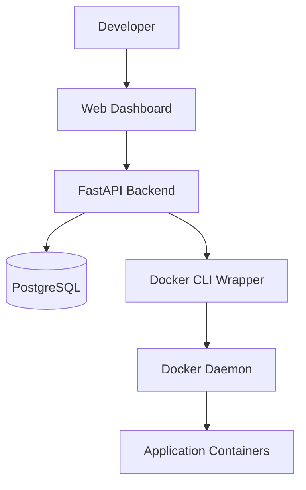

# Self-Service Deployment Portal

> Deploy Dockerized applications through a web interface.
> No SSH. No manual `docker run`. Full deployment history and rollback support.


---

# 📌 Overview

The Self-Service Deployment Portal is an internal platform that enables developers to deploy Dockerized applications through a web dashboard instead of manually connecting to servers and executing Docker commands.

The platform automates container deployments, maintains deployment history, supports rollback operations, and provides an audit trail for every deployment event.

The goal is simple:

**Make deployments safer, faster, and easier without giving every developer SSH access to production servers.**

---

# 🧩 The Problem

Many small teams start deployments using a workflow similar to:

```bash
ssh user@server

git pull

docker build -t myapp:v2 .

docker stop myapp

docker rm myapp

docker run -d \
  --name myapp \
  -p 80:80 \
  myapp:v2
```

This works initially but creates several operational problems:

* Manual deployment mistakes
* Shared server access
* No deployment history
* Difficult rollback procedures
* Limited visibility into who deployed what
* No centralized audit trail
* Inconsistent deployment processes across team members

As systems grow, deployments become increasingly risky and time-consuming.

---

# 💡 The Solution

The Self-Service Deployment Portal replaces manual deployment workflows with a centralized deployment platform.

Instead of SSH access, developers:

1. Register applications
2. Register Docker image versions
3. Click Deploy

The platform automatically:

* Pulls container images
* Stops existing containers
* Removes old containers
* Starts new containers
* Tracks deployment status
* Records deployment logs
* Maintains deployment history
* Supports one-click rollback

---

# ✨ Features

## 🔐 Authentication

* JWT-based authentication
* Secure password hashing using bcrypt
* User registration and login
* Protected API endpoints

## 📦 Application Registry

* Create and manage applications
* Organize deployment versions
* Multi-user support
* Ownership isolation

## 🏷 Version Management

Register Docker image versions such as:

```text
nginx:alpine
redis:7
yourusername/myapp:v1.0.0
```

Track which versions were deployed and when.

---

## 🚀 One-Click Deployments

Deploy applications directly from the dashboard.

The platform automatically:

```text
Pull Image
↓
Stop Previous Container
↓
Remove Previous Container
↓
Start New Container
↓
Verify Running State
↓
Update Deployment Status
```

---

## ⏪ Rollback Support

Rollback to previously deployed versions with a single click.

Every deployment maintains relationships to previous deployments, making rollback operations traceable and auditable.

---

## 📊 Deployment Tracking

Track deployment lifecycle states:

```text
pending
in_progress
success
failed
rolled_back
```

The dashboard updates deployment status automatically.

---

## 📝 Audit Logging

Every deployment step is recorded:

* Image pull
* Container stop
* Container removal
* Container creation
* Container startup
* Error events

This provides complete deployment visibility and troubleshooting information.

---

## 🐳 Docker-Native Architecture

The platform communicates directly with the host Docker daemon using the Docker CLI.

No manual Docker operations are required after deployment setup.

---

# 📸 Screenshots

## Login Page


---

## Dashboard


---

## Application Management


---

## Successful Deployment


---

## Docker Verification


---

## Rollback Functionality


---

## Deployed Application Verification


---

## System Architecture



---

# ⚙ Tech Stack

## Backend

* FastAPI
* SQLAlchemy
* Alembic
* Pydantic
* PostgreSQL

## Authentication

* JWT
* bcrypt

## Infrastructure

* Docker
* Docker Compose

## Frontend

* Bootstrap 5
* Vanilla JavaScript

## Deployment Engine

* Docker CLI
* Background Tasks

---

# 🚀 Quick Start

## 1. Clone the Repository

```bash
git clone https://github.com/Guna-Asher/Self-Service-Deployment-Portal.git

cd Self-Service-Deployment-Portal
```

---

## 2. Create Environment File

```bash
cp .env.example .env
```

Generate a secure secret key:

```bash
openssl rand -hex 32
```

Update:

```env
SECRET_KEY=<generated-key>
```

---

## 3. Start the Application

```bash
docker compose up -d --build
```

Verify services:

```bash
docker compose ps
```

Expected:

```text
db    healthy
api   Up
```

---

## 4. Run Database Migrations

```bash
docker compose exec api alembic upgrade head
```

---

## 5. Open the Dashboard

```text
http://localhost:9000
```

Register an account and begin deploying applications.

---

# 🎮 Example Deployment

## Create Application

Example:

```text
My Nginx Application
```

---

## Register Version

Version Tag:

```text
v1.0
```

Image Name:

```text
nginx:alpine
```

---

## Deploy

Click:

```text
Deploy
```

The platform will:

```text
Pull nginx:alpine
↓
Create container
↓
Start container
↓
Verify container state
↓
Mark deployment successful
```

---

## Verify

```bash
docker ps | grep nginx
```

```bash
curl http://localhost:8081
```

Expected output:

```text
Welcome to nginx!
```

---

# 🧠 Interesting Engineering Challenges

This project encountered several real-world engineering problems during development.

## Docker SDK Compatibility Issues

The original implementation used the official Docker Python SDK.

During testing, compatibility issues between the SDK and host Docker daemon resulted in deployment failures.

The final solution replaced the SDK with direct Docker CLI execution through subprocess calls.

---

## Deployment History Design

Rollback functionality required maintaining deployment relationships while preserving complete auditability.

The final implementation uses linked deployment records that maintain deployment lineage and rollback history.

---

## Deployment Audit Logging

Visibility during deployment failures was difficult without detailed execution tracking.

A dedicated deployment logging system was introduced to capture every deployment operation and error event.

---

# 🔒 Current Limitations

This project is intentionally designed as an internal deployment platform.

Current limitations include:

* Single-host deployments
* No Kubernetes integration
* No container resource quotas
* No RBAC (Role-Based Access Control)
* No HTTPS termination by default
* No health-check based auto rollback
* No private registry credential management

These areas are planned for future iterations.

---

# 🗺 Roadmap

## Completed

* ✅ JWT Authentication
* ✅ Docker Deployments
* ✅ Rollback Support
* ✅ Audit Logging
* ✅ Version Management

## In Progress

* 🚧 Health Checks
* 🚧 CI/CD Integration

## Planned

* 📌 Kubernetes Deployments
* 📌 Prometheus Metrics
* 📌 Grafana Dashboards
* 📌 Webhook Deployments
* 📌 Real-Time Log Streaming
* 📌 Role-Based Access Control
* 📌 Private Registry Authentication

---

# 📚 Detailed Documentation

This README focuses on project overview and quick-start instructions.

For deeper technical documentation, architecture discussions, deployment internals, troubleshooting history, engineering decisions, and development journal entries, see:

```text
Docs/PROJECT_DOCUMENTATION.md
```

Topics covered there include:

* Database design
* Deployment internals
* Rollback implementation
* Docker CLI design decisions
* API architecture
* Error history
* Root cause analyses
* Development journal
* Troubleshooting guide

---

# ⭐ Why This Project?

Most deployment projects stop at CRUD operations.

This project focuses on a real operational problem:

**How can developers deploy applications safely without direct server access while preserving deployment history, rollback capability, and auditability?**

The Self-Service Deployment Portal answers that question with a practical, production-inspired implementation built using FastAPI, PostgreSQL, Docker, and modern backend engineering practices.
